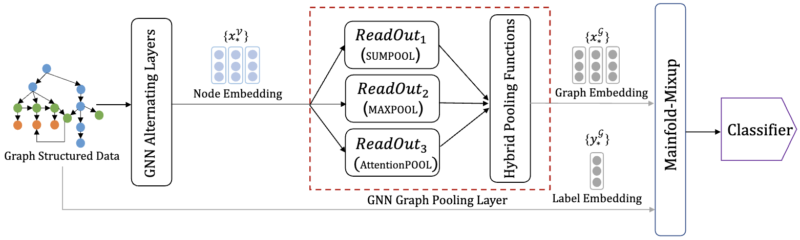

#  On the Effectiveness of Hybrid Pooling in Mixup-Based Graph Learning for Language Processing
Implementation of Journal of Systems and Software (JSS 2024) paper: On the Effectiveness of Hybrid Pooling in Mixup-Based Graph Learning for Language Processing [[arxiv]](https://arxiv.org/abs/2210.03123). 

We build this project on the top of [GNN-FakeNews](https://github.com/safe-graph/GNN-FakeNews/tree/main) and [Project_CodeNet](https://github.com/IBM/Project_CodeNet). Please refer to these projects for more details.

## Introduction
The performance of linear interpolation methods, especially those used for graph learning, can be significantly influenced by graph pooling operators. To investigate this, we conduct a comprehensive empirical study by applying Manifold-Mixup to a formal characterization of graph pooling. This study encompasses 11 graph pooling operations, including 9 hybrid and 2 non-hybrid pooling operators, to explore how these operators affect the performance of Mixup-based graph learning.

<div align=center></div>

## Requirements
On Ubuntu:

### Installation
- install python packages
```shell
pip install tqdm
pip install pandas
pip install ogb
pip install keras
pip install scikit-learn
pip install scipy
```

- Task: Problem Classification
```shell
Python>=3.6
cuDNN>=7.6
PyTorch>=version 1.8.0) 
Pytorch Geometric>=version 1.6.3
CUDA 11.0
```

- Task: Fake News Detection
```shell
Python>=3.6
cuDNN>=7.6
Pytorch>=version 1.8.0
Pytorch Geometric>=version 1.6.3
CUDA 11.0
```
## Experiments
The script to run the experiments is `./run.sh`

- Task: Problem Classification
```shell
cd text_detection

./run.sh
```
- Task: Fake News Detection
```shell
cd Problem_classification/gnn-based-experiments

./run.sh
```

## Dataset
- Java250: https://developer.ibm.com/exchanges/data/all/project-codenet/
- Python800: https://developer.ibm.com/exchanges/data/all/project-codenet/
- Gossipcop/Politifact: https://drive.google.com/drive/folders/1OslTX91kLEYIi2WBnwuFtXsVz5SS_XeR?usp=sharing

## Citation
If you use the code in your research, please cite:
```bibtex
    @article{DONG2024112139,
    title = {On the effectiveness of hybrid pooling in mixup-based graph learning for language processing},
    journal = {Journal of Systems and Software},
    volume = {216},
    pages = {112139},
    year = {2024},
    issn = {0164-1212},
    doi = {https://doi.org/10.1016/j.jss.2024.112139},
    author = {Zeming Dong and Qiang Hu and Zhenya Zhang and Yuejun Guo and Maxime Cordy and Mike Papadakis and Yves Le Traon and Jianjun Zhao},
    }
```
